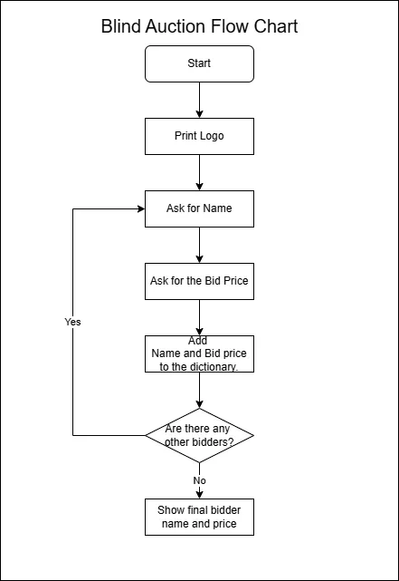

# blind auction



```shell
.
├── README.md
├── blind_auction.py
├── blind_auction.webp
├── exam_score.py
└── modules
    ├── __pycache__
    │   ├── clear.cpython-312.pyc
    │   └── logo.cpython-312.pyc
    ├── clear.py
    └── logo.py
```