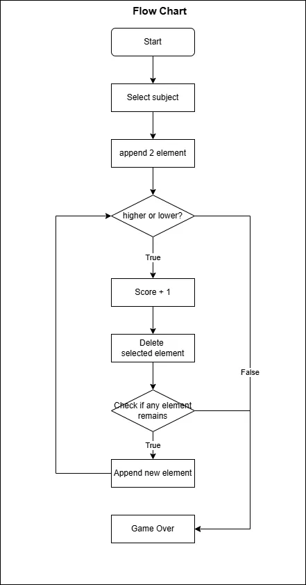

# Higher Game



```shell
.
├── README.md
├── data
│   └── data.csv
├── higher_game.py
├── higher_lower_game.webp
└── modules
    ├── __pycache__
    │   ├── art.cpython-312.pyc
    │   ├── clear.cpython-312.pyc
    │   └── read_file.cpython-312.pyc
    ├── art.py
    ├── read_file.py
    └── user.py
```