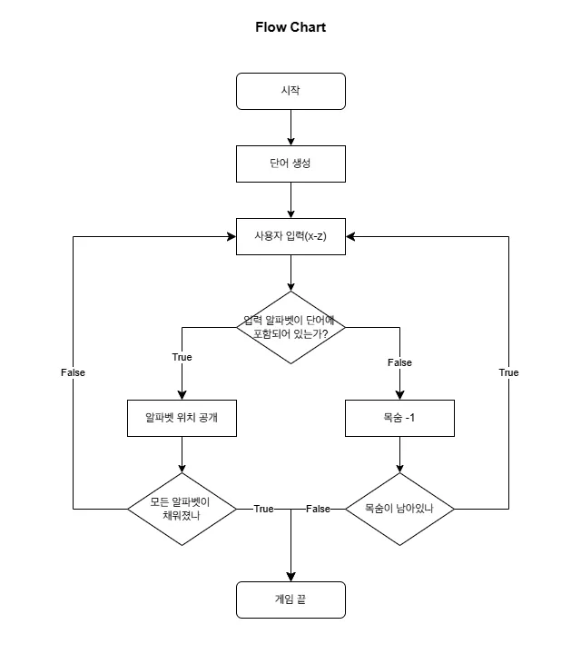

# 행맨 만들기

## 플로우 차트



```shell
.
├── README.md
├── hangman_final.py
├── hangman_step1.py
├── hangman_step2.py
├── hangman_step3.py
├── hangman_step4.py
├── modules
│   ├── __pycache__
│   │   ├── hangman_art.cpython-312.pyc
│   │   ├── hangman_modules.cpython-312.pyc
│   │   └── hangman_words.cpython-312.pyc
│   ├── hangman_art.py
│   ├── hangman_modules.py
│   └── hangman_words.py
└── 행맨.webp
```