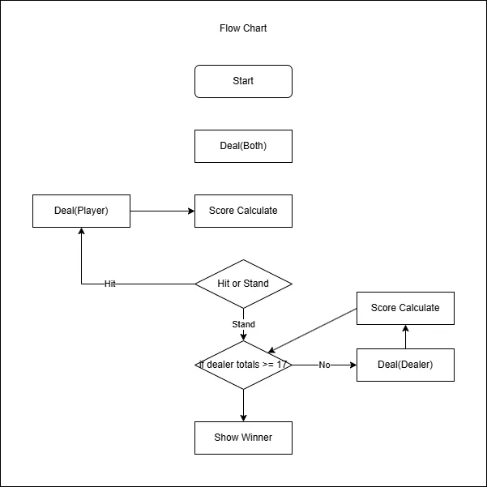

# Blackjack



```shell
.
├── Blackjack.webp
├── README.md
├── blackjack.py
└── modules
    ├── __pycache__
    │   ├── art.cpython-312.pyc
    │   └── clear.cpython-312.pyc
    ├── art.py
    └── clear.py
```
