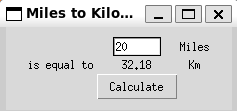

# Goal: Tkinter Basic, *args, **kwargs



## Unlimited Arguments

- 함수에 몇 개의 인자를 전달할지 미리 정해지지 않은 경우, 함수가 여러 개의 인자를 받을 수 있게 해주는 기능

### *args (가변 위치 인자)

- 함수에 몇 개의 인자를 전달할지 모를 때 사용. 함수 내에서 `*args`는 튜플로 처리되며, 여러 개의 인자를 받아낼 수 있음

```python
def add(*args):
    return sum(args)

print(add(1, 2, 3))        # 6
print(add(1, 2, 3, 4, 5))  # 15
```

### **kwargs (가변 키워드 인자)

- `**kwargs`를 사용해 여러 개의 키워드 인자를 받을 수 있음. 함수 내에서 `**kwargs`는 딕셔너리로 처리되며, 키와 값을 함께 받아낼 수 있음

```bash
.
├── Other_Tkinter_Widgets.py
├── README.md
├── main.py
├── mile_to_kilo_converter.py
├── playground.py
└── tkinter_challenge.py

1 directory, 6 files
```